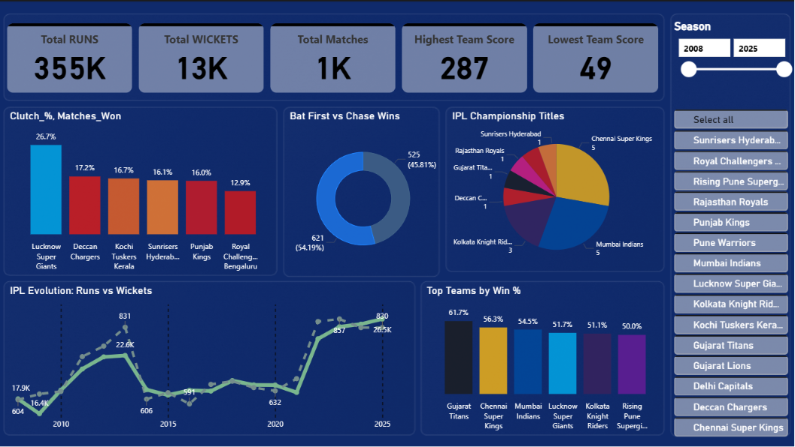
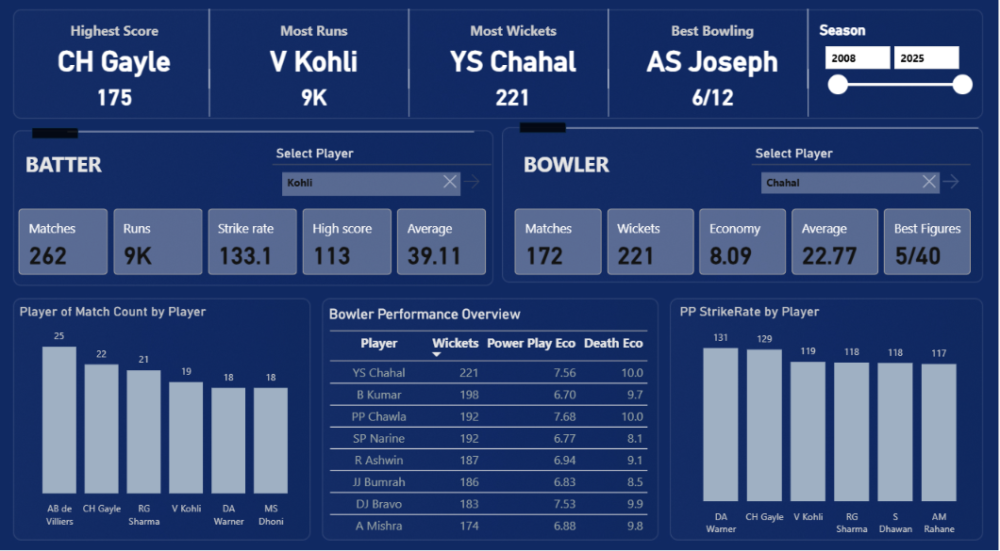
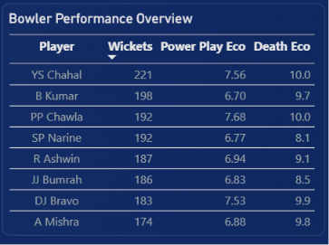

# 🏏 IPL InsightHub  
### End-to-End Cricket Analytics Platform | Data Engineering + Power BI

## 📌 Project Overview

IPL InsightHub is a complete end-to-end cricket analytics platform built on Microsoft SQL Server Data Warehouse + Power BI using Medallion Architecture (Bronze → Silver → Gold).

Raw Indian Premier League datasets are ingested, cleansed, modeled into a star schema, and finally visualized through an interactive Power BI dashboard.

This project demonstrates real-world Data Engineering + Analytics Engineering + BI Reporting concepts including:

  -ETL pipelines using stored procedures
  
  -Layered medallion architecture
  
  -Data cleansing & standardization
  
  -Dimensional modeling
  
  -Surrogate keys
  
  -Analytical fact tables
  
  -Business KPI dashboards

The Gold layer directly feeds Power BI for professional-grade reporting.
---

## 🏗️ Architecture – Medallion Pattern

### 🥉 Bronze Layer (Raw Data Ingestion)

Purpose:
- Stores raw CSV data without transformation.
- Acts as immutable historical storage.

Tables:
- matches  
- batting_scorecard  
- bowling_scorecard  
- deliveries_ball_by_ball  
- innings_totals  

Loading Method:
- BULK INSERT
- Stored Procedure: bronze.proc_load_bronze_ipl

---

### 🥈 Silver Layer (Cleaned & Standardized)

Purpose:
- Data cleansing
- Null handling
- Type casting
- Date standardization
- Column normalization
- Deduplication

Transformations:
- Standardized match dates
- Removed invalid rows
- Normalized team and player names
- Converted numeric fields
- Structured operational tables

Scripts:
- silver_ddl.sql  
- proc_insert_silver.sql  

---

### 🥇 Gold Layer (Analytics & Star Schema)

Purpose:
- Dimensional modeling
- Surrogate keys
- Fact and dimension tables
- Aggregations for BI tools

Dimensions:
- dim_team  
- dim_player  

Facts:
- fact_batting  
- fact_bowling  
- fact_match  
- fact_deliveries
- fact-innings  

Features:
- ROW_NUMBER surrogate keys
- Relationship-ready schema
- Optimized analytical structure

Script:
- gold_ddl.sql

---

## 📁 Project Folder Structure

IPL-Analytics-Data-Warehouse/

Images/
- Dash-1.png
- Dash-2.png
- Blower-stats.png
- Clutch per.png
- Deff vs Chase.png
- PP Strike rate.png
- Player of the match count.png

Power BI Dashboard/
- IPL_Dashbord.pbix
- IPL_Dashbord.pdf

datasets/
- matches_fixed_full1170.csv
- batting_scorecard.csv
- bowling_scorecard.csv
- deliveries_ball_by_ball_corrected.csv
- innings_totals.csv

scripts/
- init_database.sql

bronze/
- bronze_ddl.sql
- proc_load_bronze_ipl.sql

silver/
- silver_ddl.sql
- proc_insert_silver.sql

gold/
- gold_ddl.sql

LICENSE

README.md

---
---

## ⚙️ Setup Instructions

### Step 1 – Create Database

Run:
scripts/init_database.sql

---

### Step 2 – Create Bronze Tables

Run:
scripts/bronze/bronze_ddl.sql

---

### Step 3 – Load Raw Data

Update CSV paths inside proc_load_bronze_ipl.sql

Execute:
EXEC bronze.proc_load_bronze_ipl;

---

### Step 4 – Create Silver Layer

Run:
scripts/silver/silver_ddl.sql

Populate:
EXEC silver.proc_insert_silver;

---

### Step 5 – Create Gold Layer

Run:
scripts/gold/gold_ddl.sql

Gold tables are now ready for analytics.

---

## 📊 Power BI Dashboard Layer

- Connected directly to **Silver Layer**
- Built interactive analytical dashboards using Power BI
- Implemented slicer-driven exploration by:
  - Season
  - Team
  - Venue
  - Player
- Designed **KPI-first layout** for executive-level insights

---

## 🔹 Batting Analytics

- Total Runs  
- Strike Rate  
- Boundary Count (4s & 6s)  
- Top Run Scorers  
- Player Consistency Metrics  

---

## 🔹 Bowling Analytics

- Economy Rate  
- Total Wickets  
- Best Powerplay Bowlers  
- Death Overs Economy  

---

## 🔹 Match & Team Insights

- Team Win Percentage  
- Matches Played vs Won  
- Toss Impact Analysis  
- Venue-wise Performance  
- Season Trends  

---

## 🔹 Delivery-Level Insights

- Phase-wise Runs (Powerplay / Middle / Death)
- Ball-by-Ball Scoring Patterns  

---

# 📊 Power BI Dashboard Showcase

The analytics layer is visualized using Power BI and connected directly to the SQL Server Data Warehouse. The dashboard enables interactive exploration of IPL data across seasons, teams, players, and match situations.

---

## 🏏 Executive Dashboard

<p align="center">
  
</p>

### Key Insights
- Overall IPL KPIs
- Team Win Percentage Analysis
- IPL Championship Distribution
- Bat First vs Chase Comparison
- Team Clutch Performance
- Season-wise Trends

---

## 🎯 Player Analytics Dashboard

<p align="center">
  
</p>

### Key Insights
- Highest Individual Score
- Most Runs
- Most Wickets
- Best Bowling Figures
- Batter Performance Metrics
- Bowler Performance Metrics
- Player Awards Analysis

---

# 📈 Detailed Visual Insights

<table align="center">
<tr>
<td align="center">

### 🏆 Player of the Match Leaders


</td>

<td align="center">

### ⚡ Powerplay Strike Rate Leaders


</td>
</tr>
</table>

---

<table align="center">
<tr>
<td align="center">

### 🎯 Bowler Performance Overview



</td>

<td align="center">

### 🔥 Team Clutch Performance


</td>
</tr>
</table>

---

<div align="center">

### 🏏 Bat First vs Chase Wins


</div>

---

## 📌 Dashboard Features

- Interactive Season Slicers
- Team-Level Performance Analysis
- Player-Level Performance Tracking
- Batting & Bowling KPIs
- Phase-Based Match Analytics
- Cross Filtering & Drillthrough
- Dynamic DAX Calculations
- Executive-Level Dashboard Design

---


# 📐 Advanced Cricket Analytics – Custom DAX Measures

This section documents key **advanced DAX measures** used in the Power BI Cricket Analytics Dashboard.  
These metrics enable deep player, team, and match-level insights such as batting peaks, bowling efficiency, clutch performance, and collapses.

All measures are built on top of the **Silver Layer** using dimensional modeling and slicer-aware calculations.

---

## 🏏 Batting Metrics

### 🔹 Highest Batting Score (B_hig_score)

Returns the highest individual score for the selected player.

```DAX
B_hig_score =
CALCULATE(
    MAX('silver batting_scorecard'[RUNS]),
    TREATAS(
        VALUES(dim_player[Player]),
        'silver batting_scorecard'[BATTER]
    )
)
```
🎯 Bowling Metrics

🔹 Bowling Average (B_avg)

Runs conceded per wicket for the selected bowler.
```DAX
B_avg =
CALCULATE(
    DIVIDE(
        SUM('silver bowling_scorecard'[RUNS_CONCEDED]),
        SUM('silver bowling_scorecard'[WICKETS]),
        0
    ),
    TREATAS(
        VALUES(dim_player[Player]),
        'silver bowling_scorecard'[BOWLER]
    )
)
```
🔹 Bowling Economy (B_Economy)

Runs conceded per over.
```DAX
B_Economy =
DIVIDE(
    'silver deliveries_ballbyball'[B_Totalruns] * 6,
    [B_Balls Delivered],
    0
)
```
🔹 Best Wickets

Maximum wickets taken in a match by the selected bowler.
```DAX
Best Wickets =
CALCULATE(
    MAX('silver bowling_scorecard'[WICKETS]),
    TREATAS(
        VALUES(dim_player[Player]),
        'silver bowling_scorecard'[BOWLER]
    )
)
```
🔹 Best Runs (for Best Bowling Figure)

Finds the minimum runs conceded for the highest wicket haul.
```DAX
Best Runs =
VAR BW = [Best Wickets]
RETURN
MINX(
    FILTER(
        ALL('silver bowling_scorecard'),
        'silver bowling_scorecard'[WICKETS] = BW
            && 'silver bowling_scorecard'[BOWLER]
                IN VALUES(dim_player[Player])
    ),
    'silver bowling_scorecard'[RUNS_CONCEDED]
)
```
🔹 Best Figure Player Name

Identifies the bowler with the best bowling figure.
```DAX
Best Figure PN =
CALCULATE(
    SELECTEDVALUE('silver bowling_scorecard'[BOWLER]),
    TOPN(
        1,
        'silver bowling_scorecard',
        'silver bowling_scorecard'[WICKETS] * 100000
            - 'silver bowling_scorecard'[RUNS_CONCEDED],
        DESC
    )
)
```
🔄 Match Momentum Metrics

🔹 Comeback Percentage

Measures how often teams convert comeback situations into wins.
```DAX
Comeback_% =
DIVIDE([Comeback_Wins], [Matches_Won])
```
🔹 Death Overs Economy

Bowling economy during death overs.
```DAX
Death_over economy =
DIVIDE(
    [Death_Over_Runs_Conceded],
    [Death_over_Balls Delivered]/6,
    0
)
```
🔹 Powerplay Economy

Bowling economy during Powerplay.
```DAX
PP Economy =
DIVIDE([PP Runs conceded],([PP Balls Delivered]/6))
```
🧠 Team Intelligence Metrics
🔹 Team Clutch Wins

Counts matches won by narrow margins (≤10 runs or ≤2 wickets).
```DAX
Team_Clutch_Wins =
VAR Team = SELECTEDVALUE(dim_team[Team])

RETURN
CALCULATE(
    DISTINCTCOUNT('silver matches'[MATCH_ID]),
    FILTER(
        ALL('silver matches'),
        (
            (
                NOT ISBLANK('silver matches'[WIN_BY_RUNS])
                && 'silver matches'[WIN_BY_RUNS] <= 10
            )
            ||
            (
                NOT ISBLANK('silver matches'[WIN_BY_WICKETS])
                && 'silver matches'[WIN_BY_WICKETS] <= 2
            )
        )
        &&
        'silver matches'[WINNER] = Team
    )
)
```
🔹 Matches Won

Total matches won by selected team.
```DAX
Matches_Won =
VAR Team =
    SELECTEDVALUE(dim_team[Team])

RETURN
CALCULATE(
    DISTINCTCOUNT('silver matches'[MATCH_ID]),
    FILTER(
        ALL('silver matches'),
        'silver matches'[winner] = Team
    )
)
```
🔹 Final Wins

Total finals won.
```DAX
Final_Wins =
CALCULATE(
    DISTINCTCOUNT('silver matches'[MATCH_ID]),
    'silver matches'[EVENT_STAGE] = "Final"
)
```
🔹 Collapse Index

Counts innings where a team collapses (under 40 runs with ≥5 wickets lost).
```DAX
Collapse_Index =
VAR Team = SELECTEDVALUE(dim_team[Team])

RETURN
CALCULATE(
    COUNTROWS('silver innings_total'),
    FILTER(
        ALL('silver innings_total'),
        'silver innings_total'[BATTING_TEAM] = Team
            &&
        'silver innings_total'[INNINGS] <= 2
            &&
        'silver innings_total'[RUNS] < 40
            &&
        'silver innings_total'[WICKETS] >= 5
    )
)
```
## 📈 Dashboard Capabilities

- KPI Cards: Runs, Wickets, Strike Rate, Economy  
- Top-N Player Rankings  
- Season / Team / Venue Slicers  
- Drill-through & Cross-filtering  
- Phase-based Bowling Analysis  
- Star-schema optimized semantic model  
- Performance-focused relationships  
- Reusable DAX measures  
- Clean analytical UI design  

---

## 🚀 Key Skills Demonstrated

- SQL Server Data Warehousing  
- Medallion Architecture (Bronze / Silver / Gold)  
- ETL Pipelines using Stored Procedures  
- Dimensional Modeling  
- Surrogate Key Implementation  
- Star Schema Design  
- Data Cleansing & Standardization  
- Power BI Data Modeling  
- Advanced DAX Measures  
- End-to-End Analytics Engineering  

---

## 🎯 Ideal For

- Data Engineering Portfolios  
- Final Year Academic Projects  
- Resume Showcases  
- Technical Interviews  
- Business Intelligence Foundations  

---

## 🔮 Future Enhancements

- Incremental Data Loading  
- Slowly Changing Dimensions (SCD Type 2)  
- Query Performance Optimization & Indexing  
- Advanced Power BI Visualizations  
- Player Clustering & Machine Learning Models  
- Workflow Orchestration using Airflow  

---

## 👨‍💻 Author

**M. Lakshmi Narasimha**  
_Data Science & Data Engineering Enthusiast_

---

⭐ If you found this project useful, consider starring the repository!
